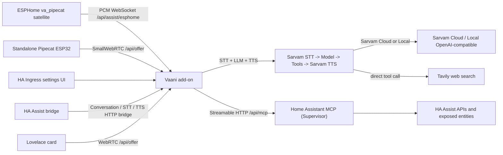

<p align="center">
  
</p>

# Vaani

<p align="center">
  <a href="https://github.com/virajpadte/ha-vaani/actions/workflows/ci.yml">
    
  </a>
  <a href="https://github.com/virajpadte/ha-vaani/actions/workflows/publish.yml">
    
  </a>
  <a href="LICENSE">
    
  </a>
  <a href="https://www.home-assistant.io/">
    
  </a>
  <a href="https://www.sarvam.ai/">
    
  </a>
</p>

Vaani is a slim, Indic-language voice assistant for
Home Assistant, built on [Sarvam AI](https://www.sarvam.ai/)'s speech and
language models. It is a focused fork of the original multi-provider
[Pipecat Assist](https://github.com/kyvaith/pipecat-homeassistant) project -
**not** a drop-in replacement and **not** planned to merge back upstream. If
you want a general-purpose, bring-your-own-provider Pipecat runtime for Home
Assistant, use the upstream project instead; this fork exists specifically to
be small, Sarvam-focused, and easy to reason about.

## What it is

A fixed realtime voice pipeline: **Speech-to-text -> Model -> Home Assistant
tools -> Text-to-speech**, with optional session memory and web search. There
is no provider picker and no visual pipeline builder - one settings screen
configures the whole thing.

- **Speech-to-text and text-to-speech**: always Sarvam AI (`saaras`/`bulbul`).
  Pick a language from a dropdown - English, Hindi, Marathi, Tamil, Telugu,
  Bengali, Gujarati, Kannada, Malayalam, Odia, or Punjabi. One setting covers
  both STT and TTS. See [Supported languages](#supported-languages).
- **The model**: Sarvam Cloud by default, or a Local (OpenAI-compatible)
  endpoint - Ollama, vLLM, LM Studio, or a self-hosted Sarvam open-weight
  model. See [Model: Sarvam Cloud vs. Local](#model-sarvam-cloud-vs-local)
  below.
- **Device control**: Home Assistant MCP through the Supervisor connection,
  automatically - no separate MCP add-on or server to configure.
- **Speaker voice**: pick a bulbul voice from a gender-labeled dropdown; for
  Marathi specifically, a matching first-person verb-form rule (feminine or
  masculine) is added to the system prompt automatically - no manual prompt
  editing needed. See [Speaker voice and the gender verb-form
  rule](#speaker-voice-and-the-gender-verb-form-rule).
- **Web search**: a direct tool call to [Tavily](https://tavily.com/)'s
  search API - no second LLM call is used to do the searching.
- **Session memory**: a short-lived, in-memory toggle so reconnecting doesn't
  immediately lose conversational context.

## Where you can use it

- **Add-on UI**: a Talk button for quick browser testing of the live pipeline.
- **Lovelace dashboard card**: a dedicated WebRTC card with a live transcript.
- **Home Assistant Assist**: the custom component exposes Vaani as
  Conversation, Speech-to-text, and Text-to-speech.
- **ESPHome voice satellites**: the bundled `va_pipecat` component provides
  wake-word turns, live transcripts, follow-up conversation, and full-duplex
  barge-in over an authenticated raw-PCM WebSocket.
- **Standalone Pipecat ESP32 clients**: the SmallWebRTC `/api/offer` endpoint
  remains available for standalone `pipecat-esp32` firmware.

## Installation

1. Add this repository URL to Home Assistant **Settings > Add-ons > Add-on
   Store > Repositories**:

   ```text
   https://github.com/virajpadte/ha-vaani
   ```

2. Add the same repository URL to **HACS > Custom repositories** as an
   **Integration**.

3. Install the **Vaani** add-on from the Home Assistant add-on store.
   It builds locally the first time, which can take a few minutes - check the
   Supervisor log for progress.

4. Install the **Vaani** custom component from HACS, then restart Home
   Assistant when HACS asks you to.

5. Add the **Vaani** integration in **Settings > Devices & services**.
   It should auto-detect the add-on URL through Supervisor.

6. In **Settings > Voice assistants**, select **Vaani** for
   Conversation, Speech-to-text, and Text-to-speech.

7. Open the Vaani add-on UI and paste your Sarvam API key, pick a
   voice and language, and confirm Home Assistant MCP shows connected.

8. Add the **Vaani** Lovelace card to a dashboard and start talking.

## Model: Sarvam Cloud vs. Local

The Model step has exactly two choices:

- **Sarvam Cloud** (default): Sarvam's hosted chat completions API. Just an
  API key.
- **Local (OpenAI-compatible)**: point at any OpenAI-compatible chat
  completions endpoint - a base URL, a model name, and an optional API key.
  This covers:
  - **Ollama**, **vLLM**, or **LM Studio** serving any model they support.
  - A **self-hosted Sarvam open-weight model**, served through vLLM or
    SGLang (both are explicitly supported per Sarvam's own model cards):
    - [`sarvamai/sarvam-1`](https://huggingface.co/sarvamai/sarvam-1) - 2B
      params, 10 Indic languages, community GGUF quantizations exist for
      llama.cpp-style local inference.
    - [`sarvamai/sarvam-30b`](https://huggingface.co/sarvamai/sarvam-30b) -
      mixture-of-experts, 2.4B active parameters, GQA, Apache 2.0 license.
    - [`sarvamai/sarvam-105b`](https://huggingface.co/sarvamai/sarvam-105b) -
      mixture-of-experts with multi-head latent attention, Apache 2.0 license.

  Sarvam's own release notes discuss running these on hardware like an H100,
  an L40S, or even a MacBook Pro M3, but **Sarvam does not publish a minimum
  VRAM figure** for any of them - this README won't invent one either. Check
  the linked model cards and your runtime's (vLLM/SGLang/Ollama) own hardware
  guidance before committing to a deployment size.

  In Local mode, instructions are sent with role `system` directly (the same
  as any standard OpenAI-compatible chat completion), and Home Assistant MCP
  tool calling works the same as with Sarvam Cloud.

STT and TTS are always Sarvam AI regardless of which Model source you pick -
Local is a Model-step-only option.

## Supported languages

One **Language** setting covers both speech-to-text and text-to-speech, picked
from a dropdown (no more hand-typing a BCP-47 code). This is the intersection
of what Sarvam's STT and TTS APIs both accept - verified against
[docs.sarvam.ai](https://docs.sarvam.ai/), not guessed:

| Language | Code |
|---|---|
| English | `en-IN` |
| Hindi | `hi-IN` |
| Marathi | `mr-IN` |
| Tamil | `ta-IN` |
| Telugu | `te-IN` |
| Bengali | `bn-IN` |
| Gujarati | `gu-IN` |
| Kannada | `kn-IN` |
| Malayalam | `ml-IN` |
| Odia | `od-IN` |
| Punjabi | `pa-IN` |

Sarvam's Speech-to-Text API alone accepts several more languages (Assamese,
Urdu, Nepali, Sanskrit, and others), but since one Language setting here
drives both STT and TTS, the list above - TTS's smaller set - is what's
offered, so STT and TTS always agree.

## Web search

Enable **Web search** in settings and paste a [Tavily](https://tavily.com/)
API key. The assistant calls Tavily's search API directly as a tool when it
decides a question needs current information - there's no extra LLM call
involved in doing the search itself, which keeps latency down.

## Speaker voice and the gender verb-form rule

Marathi marks the speaker's gender in first-person verb forms. When the
configured language is Marathi, picking a bulbul voice from the gender-labeled
dropdown automatically adds a matching system rule, e.g. for a female voice:
*"You are a woman; use feminine first-person Marathi verb forms (करते, शकते,
सांगते, आले, केले), never masculine (करतो, शकतो, आलो)."* - and the masculine
equivalent for a male voice. You don't need to edit the system prompt by hand
for this.

This rule is Marathi-specific grammar and is only ever added when Language is
set to Marathi (`mr-IN`); gender agreement rules differ across Sarvam's other
supported languages and aren't asserted here without being verified first.
For other languages, the voice dropdown still groups by gender, but no
grammar rule is added - the model follows its own default behavior.

## Home Assistant MCP

Vaani uses Home Assistant's Model Context Protocol server through the
Supervisor connection automatically (`homeassistant_api: true`) - there is no
separate MCP add-on or custom MCP server to configure. Open the settings page
and use **Test** to confirm the connection and see the available tool count.

At session start, the assistant loads the list of devices you've exposed to
Assist (name, domain, area) into its system context, so it can match what you
say - in your configured language, English, or mixed - to the right device
without you ever hardcoding device names anywhere. If an action can't be
matched to an exact device, the assistant asks one short clarifying question
instead of saying "not found."

For "turn off/on all lights" style requests, the assistant prefers a single
domain-wide call when turning things off, falls back to one call per device
when turning things on (Home Assistant has no built-in "turn on everything"
intent), also matches `switch` entities named like a lamp/light, and confirms
out loud exactly what changed.

## ESPHome satellites

The repository includes the `va_pipecat` ESPHome external component:

```yaml
external_components:
  - source: github://virajpadte/ha-vaani@main
    components: [va_pipecat]

api:
  custom_services: true

va_pipecat:
  id: pipecat_va
  auto_provision: true
  microphone:
    microphone: processed_microphone
    channels: 0
  speaker: assistant_speaker
  barge_in: true
```

The add-on resolves the Home Assistant LAN host and sends the authenticated
URL through the device's native API action - no token-bearing text entity is
created. See [the component reference](components/va_pipecat/README.md) and
[architecture notes](docs/architecture/esphome-satellite.md) for the full
configuration and conversation lifecycle.

Standalone `pipecat-esp32` clients remain supported through the SmallWebRTC
`/api/offer` endpoint.

## Migrating from an older install

Your Sarvam API key, STT/LLM/TTS models, voice, language, and custom
instructions/greeting all carry over automatically - nothing to re-enter.
If you're upgrading from a pre-Sarvam-only build, any other provider you had
configured (Gemini, OpenAI, Deepgram, etc.) is dropped, since those
providers no longer exist in this build.

The add-on's slug (`sarvam_assist`) did **not** change with this rename, so
it updates in place with no reinstall. The **Home Assistant integration's
domain did change** (`pipecat_assist` -> `sarvam_assist` -> now `vaani`), so:

- Remove the old `Sarvam Assist`/`Pipecat Assist` Home Assistant integration
  entry and add **Vaani** again once (update any automations/scripts
  referencing old `sarvam_assist.*`/`pipecat_assist.*` entity IDs to the new
  `vaani.*` ones).
- Update any Lovelace dashboard using `custom:sarvam-assist-card` or
  `custom:pipecat-assist-card` to `custom:vaani-card`.

## Repository layout

- `addons/pipecat_assist` - the Home Assistant add-on (directory name and
  slug `sarvam_assist` kept for continuity across renames; the add-on's
  display name is "Vaani"). It runs the fixed pipeline, serves the settings
  UI through Ingress, exposes WebRTC and ESPHome satellite transports, and
  connects to Home Assistant MCP.
- `addons/pipecat_assist/ui-src` - the React source for the settings UI,
  shipped as static assets inside the add-on image.
- `components/va_pipecat` - the ESPHome external component and its device-side
  PCM transport.
- `custom_components/vaani` - the Home Assistant integration exposing
  Vaani as Conversation, STT, TTS, AI Task entities, and the Lovelace
  WebRTC card asset.
- `.github/workflows` - CI and GHCR publishing workflows for multi-arch Home
  Assistant images.

## Architecture



## Development

```bash
python -m compileall addons/pipecat_assist/app custom_components/vaani
```

For the settings UI:

```bash
cd addons/pipecat_assist/ui-src
pnpm install
pnpm build
```

For a container build:

```bash
docker build -t vaani:dev addons/pipecat_assist
```

## References

- Sarvam AI docs: https://docs.sarvam.ai/
- Sarvam open-weight models: https://huggingface.co/sarvamai
- Tavily search API: https://docs.tavily.com/
- Pipecat: https://github.com/pipecat-ai/pipecat
- Pipecat ESP32: https://github.com/pipecat-ai/pipecat-esp32
- Home Assistant MCP server: https://www.home-assistant.io/integrations/mcp_server/
- Home Assistant app docs: https://developers.home-assistant.io/docs/apps/configuration/
- Upstream (general-purpose, multi-provider) project this was forked from:
  https://github.com/kyvaith/pipecat-homeassistant
